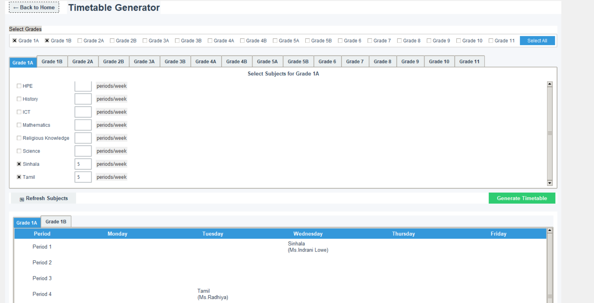

# 🏫 School Timetable Manager


A comprehensive desktop application for managing school teachers, their subject assignments, and grade-level allocations. Built with Python and Tkinter for easy school administration.




## ✨ Features

### Teacher Management
- ➕ Add new teachers with complete details
- ✏️ Edit existing teacher information
- 🗑️ Remove teachers from the system
- 📋 View all teachers in a scrollable list

### Subject Assignment
- 📚 Assign subjects to specific grade levels
- 👩‍🏫 Link subjects to teachers
- 🔍 Filter assignments by teacher or grade
- 📊 View current subject allocations

### Data Management
- 💾 Automatic JSON data persistence
- 🔄 Real-time data updates
- 🛡️ Data validation and error handling
- 📂 Automatic directory creation for data storage

### User Experience
- 🎨 Modern, customizable interface
- 🔎 Intuitive search and filtering
- 📱 Responsive design for different screen sizes
- ⚠️ Confirmation dialogs for critical actions

## 🚀 Getting Started

### Prerequisites
- Python 3.8 or higher
- Tkinter (usually comes with Python)

### Installation
1. Clone the repository:
   ```bash
   git clone https://github.com/your-username/school-timetable-manager.git
   cd school-timetable-manager

2.Set up virtual environment (recommended):

       ```bash
      python -m venv venv
      # Windows:
      venv\Scripts\activate
      # macOS/Linux:
      source venv/bin/activate  

 3.Install dependencies:

    ```bash
    pip install -r requirements.txt    

 4. Run the application:

   ```bash
   python src/main.py   
**##🖥️ Usage**
###Adding a New Teacher
Click "Add Teacher" from the main menu

Fill in teacher details (name, contact info, etc.)

Click "Save" to add to the system

###Managing Subjects
Select a teacher from the dropdown

Choose subjects from the available list

Assign to specific grade levels

Click "Save Assignments"

###Viewing Schedules
Use the calendar view to see daily schedules

Filter by teacher, grade, or subject

Print or export schedules as needed

##📂 Project Structure

school-timetable/
├── data/                   # JSON data files
│   ├── teachers.json
│   └── subjects.json
├── src/                    # Source code
│   ├── main.py             # Entry point
│   ├── teacher_manager.py  # Teacher management
│   ├── schedule_manager.py # Scheduling logic
│   └── ui/                 # UI components
├── tests/                  # Unit tests
├── requirements.txt        # Dependencies
└── README.md

##🛠️ Development
Running Tests
```bash
python -m unittest discover tests

##🤝 Contributing
Fork the repository

Create your feature branch (git checkout -b feature/your-feature)

Commit your changes (git commit -m 'Add some feature')

Push to the branch (git push origin feature/your-feature)

Open a Pull Request

##📜 License

Distributed under the MIT License. See LICENSE for more information

## 📜 Version History

- 1.0.0 (2023-11-15)
  - Initial release with basic teacher management
## 💻 System Requirements

- Windows 10+/macOS 10.15+/Linux Ubuntu 20.04+
- 4GB RAM minimum
- 200MB disk space
